<!--
**fcosantosserrano/fcosantosserrano** is a ✨ _special_ ✨ repository because its `README.md` (this file) appears on your GitHub profile.

Here are some ideas to get you started:

- 🔭 I’m currently working on ...
- 🌱 I’m currently learning ...
- 👯 I’m looking to collaborate on ...
- 🤔 I’m looking for help with ...
- 💬 Ask me about ...
- 📫 How to reach me: ...
- 😄 Pronouns: ...
- ⚡ Fun fact: ...
-->
<!-- Banner opcional -->

  

---

# 👋 ¡Hola! Soy **Francisco Santos**

📍 Desarrollador orientado a **Java**, **Android**, **bases de datos**, y creación de apps prácticas  
🚀 Actualmente desarrollando:
- Aplicación Android de **gastos compartidos** con Firebase  
- Sistema de **inventario de alimentos** con SQL + app móvil  

💡 Siempre estudiando más sobre **accesibilidad**, **arquitecturas limpias**, y buenas prácticas.
---
## 🛠️ Tech Stack

### Lenguajes y tecnologías principales

  

### Otras herramientas

---

## 📊 Estadísticas

### 📈 GitHub Stats

  

### 🏆 GitHub Metrics
(Se actualiza automáticamente cada 6 horas)

---

## ⭐ Proyectos Destacados

### 🔥 App de gastos compartidos (Android + Firebase)
📌 Sincronización en tiempo real  
📌 Gestión multiusuario  
📌 Interfaz intuitiva  

### 📦 Sistema de inventario de alimentos
📌 SQL Workbench  
📌 JAVA
📌 App móvil futura con escáner de códigos de barras  

### 🎮 Juego Java con ruleta
📌 Gestor de jugadores  
📌 Partidas con MySQL  
📌 Lógica avanzada de juego  

---

## 📬 Contacto

🔗 LinkedIn: *LinkedIn*  
🐙 GitHub: **github.com/fcosantosserrano**

---

  

