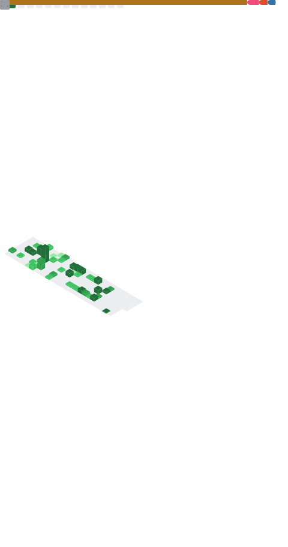

  <b>📱 Desarrollador Multiplataforma | ☕ Java | 🗄️ Bases de datos</b> 
  Amante de crear apps útiles, limpias y con buen rendimiento.

---

## 🧠 Sobre mi

Soy un desarrollador multiplataforma que busca crecer en este mundo conociendo lenguajes:
- Desarrollando en Android con sincronizaciónes en tiempo real  
- Aprender Backend para fortalecer mis conocimientos  
- Apps prácticas como controlar y gestionar productos  
- Aprender a automatizar todo 

Me gusta aprender rápido, resolver problemas y crear software que funcione **de verdad**, no solo demos.

---

## 🛠️ Skills & tecnologías

### 🔹 Lenguajes

  

### 🔹 Herramientas & frameworks

  

---

## 🚀 Proyectos Destacados

### 📱 **App Android de Gastos Compartidos** (en desarrollo)
- Hecha en Android Studio  
- Firebase Auth + Firestore  
- Gestión multiusuario en tiempo real  
- Cálculo automático de deudas

---

### 🍔 **Inventario de Comida con MySQL**  (en desarrollo)
- Gestión de alimentos y caducidades  
- Ideal para no tirar comida  
- Listo para futura app móvil + lector de códigos de barras

---

### 🎮 **Juego en Java: Ruleta de la Fortuna**
- Sistema de jugadores  
- Base de datos MySQL  
- Estadísticas y dinámica de partida

---

## 📊 Mis estadísticas

### 🔹 GitHub Metrics (auto-actualizado)

  

---

## 🧩 Extras

### 📈 Actividad reciente

  

---

## ☁️ Salesforce & Formación

### 🧩 Skills en Salesforce

### 🏅 Trailhead

  

---

## 📫 Contacto

  
  &nbsp;
  

---

